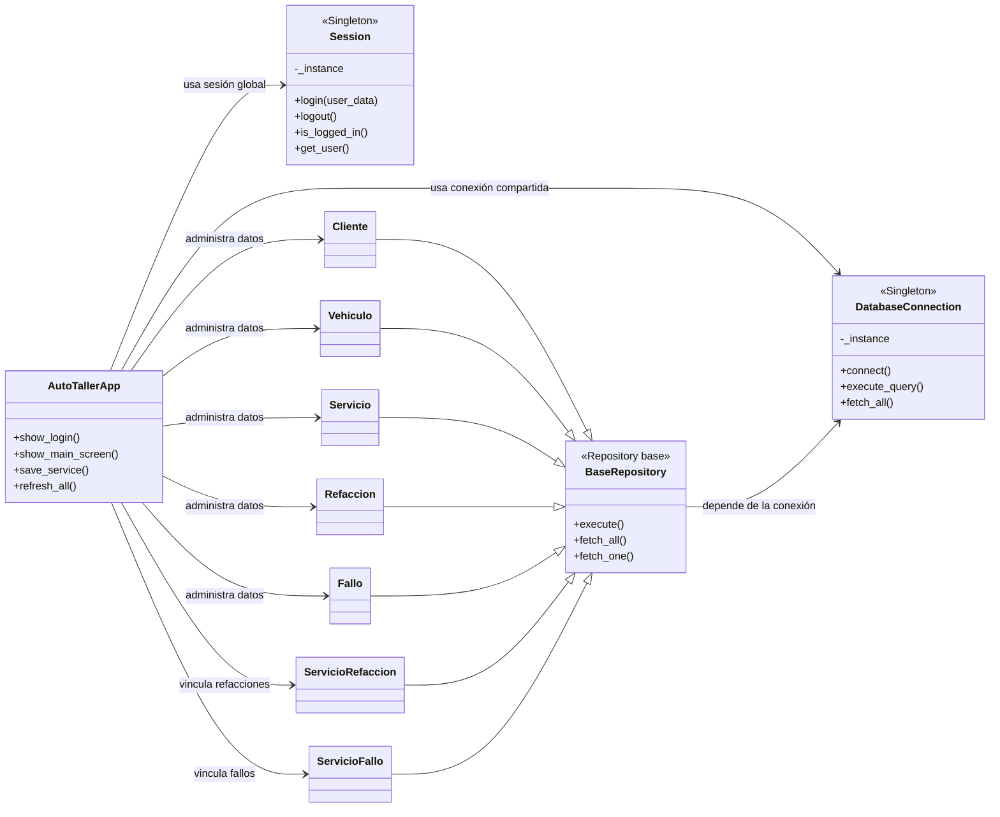

# Arquitectura y patrones del sistema

Este diagrama resume dónde están los patrones de diseño que usa el proyecto.

## Cómo leerlo

- `Session` y `DatabaseConnection` son Singleton porque el sistema necesita una sola instancia compartida.
- Los modelos heredan de `BaseRepository`, que centraliza el acceso a la base de datos.
- `AutoTallerApp` solo orquesta la interfaz; no guarda la lógica de datos.